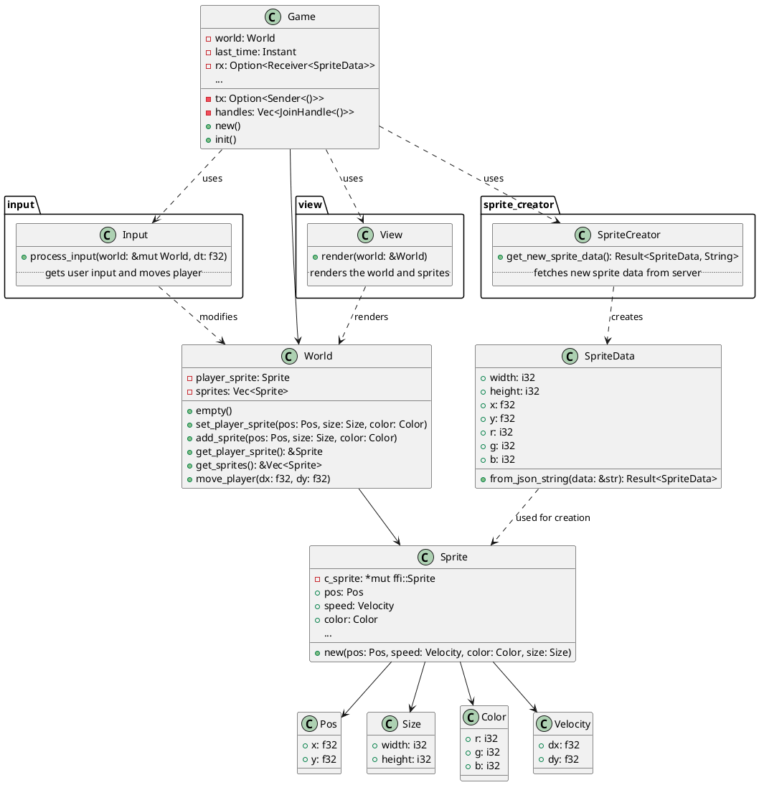
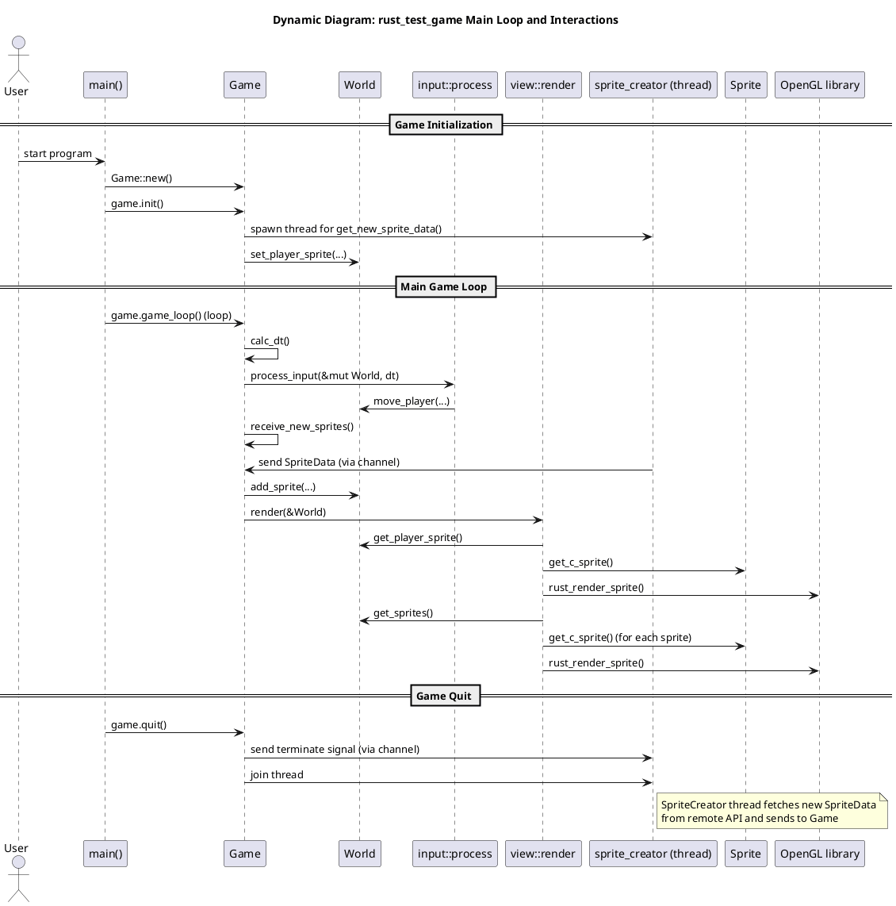

# Project for "Introduction to Rust"

Based on starter files (https://github.com/udacity/cd13678-intro-to-rust-starter)

## Test C library with test game

To check that the C library is built correctly and can be used the C test game can be started:

```
make run-c
```

## Using the C library in Rust

Folder `game_engine`.

- build.rs is created which builds the C library when the rust project `game_engine` is built.
- The C function signatures and structs are made available for Rust in `ffi.rs`
- The corresponding Rust functions that call the C functions are in the same file.
- Test cases for the functions are implemented in `lib.rs`.
- Macros to simplify tasks (like expected by the project rubric) are implemented in `macros.rs`.

## Simple sample game in Rust

Folder `rust_test_game`.

### Features

- Shows simple sprites in a windows using the `game_engine`
- Starts with a player sprite that can be moved on the screen with the cursor keys
- Spawns new sprites with data that was loaded from a webserver
- Since the webserver has long latency, the downloads are done in a separate thread
- IPC between the main- and the download-thread is done with crossbeam_channel
- When the game should terminate, the main threads triggers the download thread to terminate over a channel and joins it

## Architecture Diagrams

### Class diagram


### Sequence diagram

