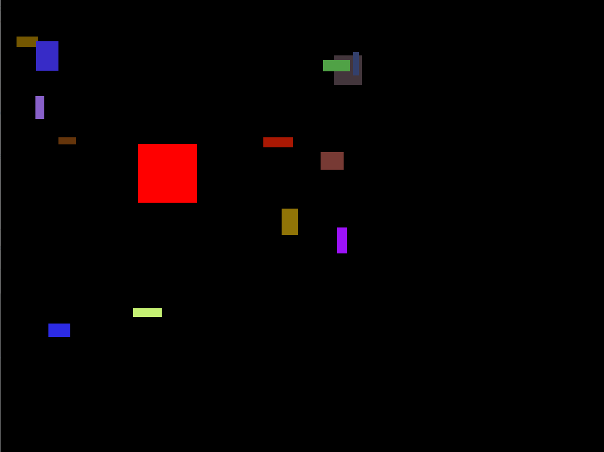
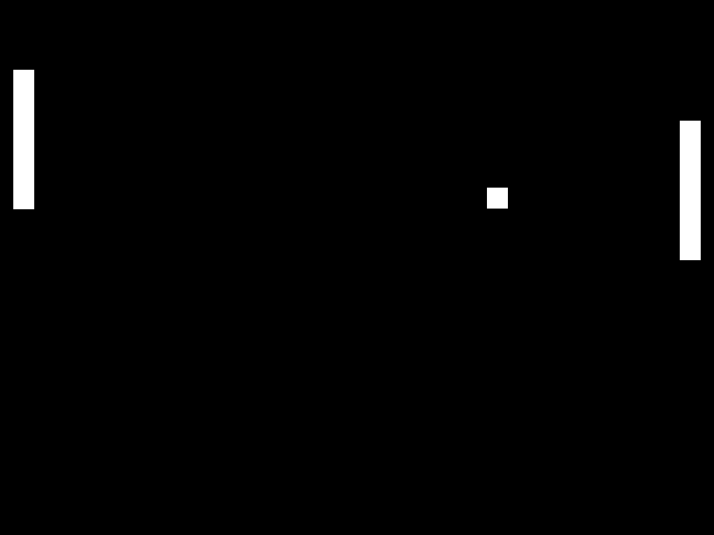
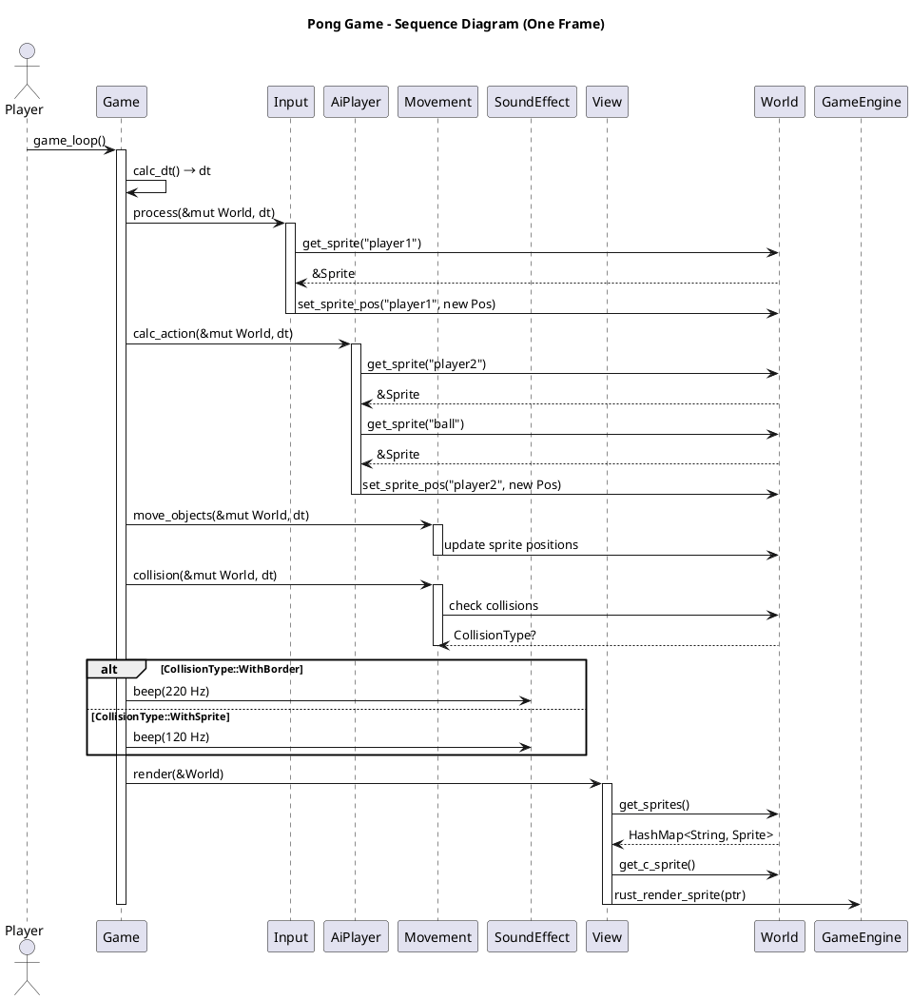

# Project for "Introduction to Rust"

Based on starter files (https://github.com/udacity/cd13678-intro-to-rust-starter)

The project has requirements to use different Rust techniques like concurrency with threads and message passing, graceful termination of the process with joining the threads, using a C library with the FFI, and using macros.

It's based on a C library that can be uses to create a window with some OpenGL functionaliy.

## Test C library with test game

To check that the C library is built correctly and can be used the C test game can be started:

```
make run-c
```

## Using the C library in Rust

Folder `game_engine`.

- build.rs is created which builds the C library when the rust project `game_engine` is built.
- The C function signatures and structs are made available for Rust in `ffi.rs`
- The corresponding Rust functions that call the C functions are in the same file.
- Test cases for the functions are implemented in `lib.rs`.
- Macros to simplify tasks (like expected by the project rubric) are implemented in `macros.rs`.

## Simple sample game in Rust

Folder `rust_test_game`.

Can be run with `cargo run` inside the folder.

### Features

- Shows simple sprites in a windows using the `game_engine`
- Starts with a player sprite that can be moved on the screen with the cursor keys
- Spawns new sprites with data that was loaded from a webserver
- Since the webserver has long latency, the downloads are done in a separate thread
- IPC between the main- and the download-thread is done with crossbeam_channel
- When the game should terminate, the main threads triggers the download thread to terminate over a channel and joins it

### Game window



## Architecture Diagrams

### Class diagram


### Sequence diagram


## Extra game Pong

As an optional extra game a simple Pong clone was created.

Folder `pong`.

Can be started with `cargo run` inside the folder.

### Features

- A player paddle is controlled by the users arrow keys.
- A computer paddle is controlled by a very simple AI.
- A ball moves around the field.
- Collision handling: if the ball collides with a paddle or the window border, it bounces.
- For collisions a simple sound effect is given out

### Game window



### Sequence diagram

Here is a sequence diagram for the calculation of one frame. Th framework around this (the loop) is the same like in the simple game.

